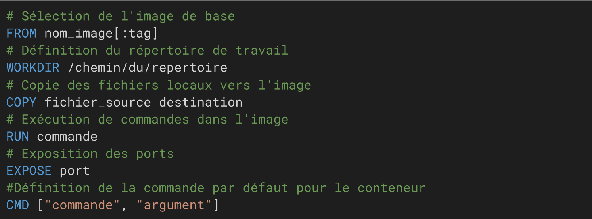
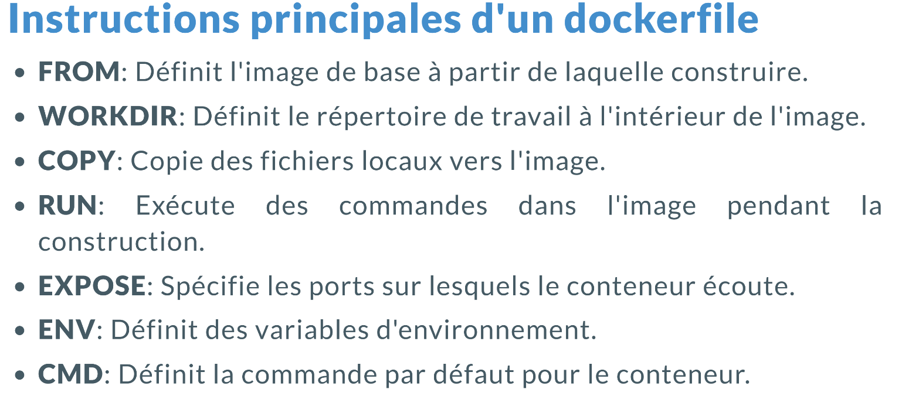
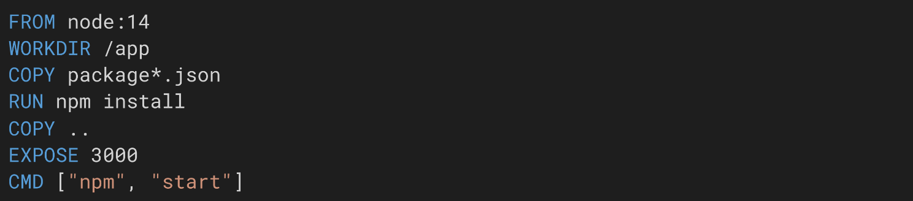
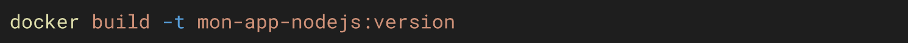

Prérequis pour exemple : 

| docker run -d -p 8080:80 --name my_nginx Nginx

| docker exec -it my_nginx bash

| apt update

| apt install nano

| nano /usr/share/Nginx/html 

(modification du '< h1 >')

| exit 

---

# Créer son image et la publier:

## 1) Via la commande Docker Commit
ça sert à transformer un conteneur en image 
utile pour avoir une image personnalisée avec nano, git, unzip ou un fichier index.html personnalisé
comme dans le cas de notre exemple

```bash
docker commit [mon_conteneur] [un_nom_pour_une_image]
--
ex : docker commit my_nginx mon_image_perso
```
petite vérification avec docker run 
```bash
docker run [option] [un_nom_pour_une_image]
--
ex : docker run -d -p 8080:80 mon_image_perso
```

## 2) se connecter avec un compte docker 
- Docker Login 
```bash
docker login 
--
pas d'exemple ici tu te débrouille
après tu suis les instructions
```

## 3) Push l'image sur docker hub

- Docker Tag
```bash
| docker tag [un_nom_pour_une_image] [ton_pseudo/image]
--
ex : docker tag mon_image_perso nscelles/nginx_perso
```

- Docker Push 
```bash
 | docker push [ton_pseudo/image]
 --
ex: docker push nscelles/nginx_perso
```

---

# Via Les 'dockerfile'

- Les dockerfile sont des fichier text contenant une série d'instruction permettant de créer une image docker
- Il spécifie les dépendances, la configuration et les étapes pour éxecuter l'opération
- Le fichier est toujours à la racine

## Structure 

- La Structure :



- Les instructions :

---


- Exemple : Création d'une image node 

---



 ## Docker Build



## La super démo de Christophe

### Exemple 1 version simple

- Prérequis : 
  - 
  - récupérer le html5up-editorial-m2i.zip de l'exercice 4

- Création du docker file ‼️ A LA RACINE ‼️
    -

```dockerfile
#Image de base
FROM nginx

# Copier notre projet dans l'image
WORKDIR /usr/share/nginx/html/

# executer des commande
RUN apt update
# notre répertoire courant étant /usr/share/nginx/html/ les commandes sont éxecuter dans ce répertoire
RUN mkdir totodossier && touch totodossier/toto.txt

# Copie des fichier
COPY . .

# Exposition de port
EXPOSE 80

# Commande pour lancer le démarrage du serveur nginx lorqu'on utilise l'image pour créer un conteneur 
CMD ["nginx", "-g","daemon off;"]
```

- Si on veux que certain fichier ne soit pas dans le Container créer avec l'image on fait un '.dockerignore' exactement comme git

- Lancement de la commande docker build
   -
```bash
docker build -t site:v1.0 .
# le "." correspond à la racine du projet
``` 


       